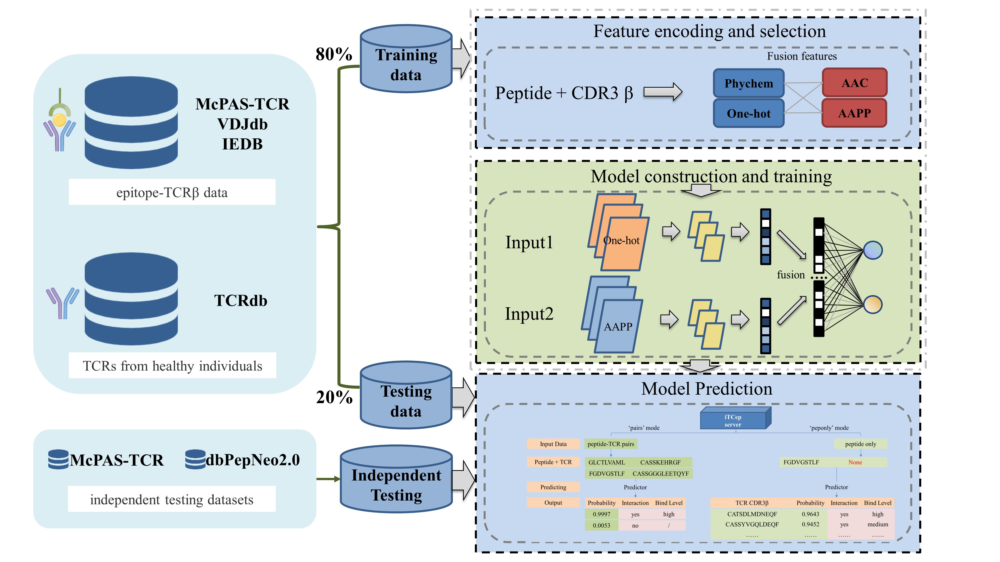

# iTCep: a deep learning framework for identification of T cell epitopes by harnessing fusion features.


## 1. Overview
The identification of cytotoxic T cell epitopes, as a foundation for developing targeted vaccines, 
is increasingly essential for tumor immunotherapy research. Here, we proposed a deep learning model 
named iTCep for predicting the interaction between peptides presented by major histocompatibility 
complex (MHC) class I molecules and TCRs based on the fusion features. The high predictive performance 
provides strong evidence that the iTCep is a reliable and robust method for identifying immunogenic 
peptides recognized by TCRs.
The iTCep webserver provides two predicting functionalities, one to predict the interaction between
the given multiple peptide-TCR pairs and the other to obtain the TCRs that could recognize the input 
peptides in accord with ranked predictive values.

The workflow of iTCep:

## 2. Installation
Download iTCep by
```
git clone https://github.com/kbvstmd/iTCep/
```
The codes depend on the following packages, please install them before getting started.
```
pip install numpy==1.19.5
pip install pandas==0.25.3
pip install biopython==1.76
pip install tensorflow==2.4.1
``` 
The build will likely fail if it can't find them. For more information, see:

## 3. Usage
### 3.1 peptide-TCR pairs prediction:
Please refer to document **'Example_file.xlsx'** in 'static' directory for the format of the input file. Column names are not allowed to change.
Run the following codes to perform the prediction.
```
python predict.py /path/to/input_file.xlsx mode1
# eg:
python predict.py test/ExampleFile.xlsx mode1
```
**notes:** 
The prediction results will be saved in the **results/pairs_pred_output.csv** file.

### 3.2 peptide only prediction:
Please refer to document **'Example_file_pep.xlsx'** in 'static' directory for the format of the input file. Column names are not allowed to change.
Run the following codes to perform the prediction.
```
python predict.py /path/to/input_file.xlsx mode2
# eg:
python predict.py test/ExampleFile_pep.xlsx mode2
```
**notes:** 
The prediction results will be saved in the **results/peptides_pred_output.csv** file.
## 4. Citation
Please cite the following paper for using iTCep:
iTCep: a deep learning framework for identification of T cell epitopes by harnessing fusion features.